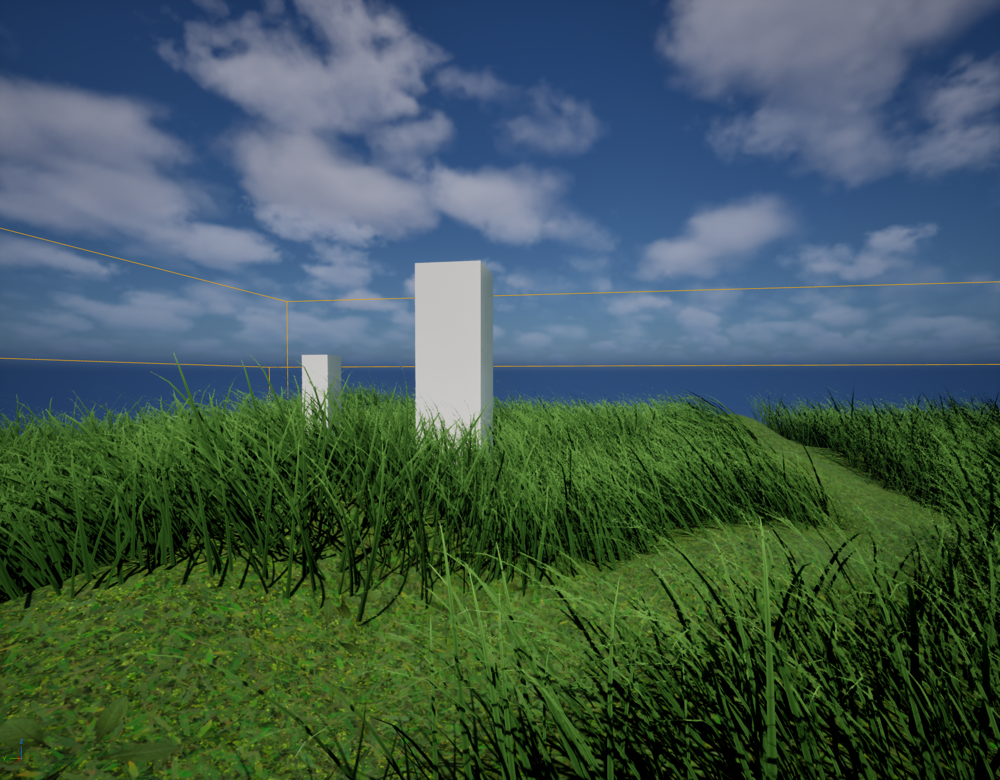

# UE5 Procedural Grassland

基于 Unreal Engine 5.8 的程序化草地实验项目，主要目标是用 PCG 生成可控的草地分布，并结合材质中的 World Position Offset 实现草叶形态和风场摆动。



## 当前进度

- 使用 `PCG Volume` 在 Landscape 上采样生成草点。
- 通过 `Surface Sampler` 控制基础密度、点尺寸和随机松散度。
- 使用 Voronoi/Spatial Noise 写入 `ClumpID`，再按区间过滤形成草簇。
- 为不同草簇接入独立的 `Transform Points`，控制每簇的缩放、旋转和分布差异。
- 使用 `Merge` 合并多路草簇结果，再进入 `Self Pruning` 和 `Static Mesh Spawner`。
- 草材质使用平面网格配合 WPO 生成草叶形态，并加入风场摆动参数。
- 通过 `PerInstanceCustomData` 从 PCG 向材质传递随机值，用于草色和局部变化。
- 支持用 Spline 和带标签的 Actor 对草地进行剔除，便于留出道路、障碍物或人工区域。
- 增加了地表草地材质，用来配合 PCG 草叶形成更完整的草地视觉。

## 关键实现

### PCG 草地生成

核心图位于：

```text
Content/ProceduarlGrass/PCG/PCG_Grass
```

当前流程大致为：

```text
Landscape Data
-> Surface Sampler
-> Spline / Actor Difference
-> Rand0 / Rand1 / ClumpID
-> Spatial Noise
-> Attribute Filter Range
-> Transform Points
-> Merge
-> Self Pruning
-> Static Mesh Spawner
```

其中 `ClumpID` 用来划分草簇，`Rand0` 和 `Rand1` 用来提供随机变化。多路过滤结果需要显式接入 `Merge`，再进入后续节点，否则后面的节点可能只处理最后一路输入。

### 草材质

草材质位于：

```text
Content/ProceduarlGrass/Materials/M_Grass
Content/ProceduarlGrass/Materials/M_Grass_Inst
```

材质中用 WPO 生成草叶形态。曲线输出是偏移向量，因此需要用 `TransformVector` 而不是 `TransformPosition`，否则 PCG 实例会出现整体位置偏移。

材质还包含风场参数和 `PerInstanceCustomData` 读取，用于让 PCG 生成的实例带有颜色和形态上的轻微差异。

### 剔除区域

目前支持两种剔除方式：

- Spline：用于道路或路径类区域。
- Actor Tag：用于用 Static Mesh Actor 或体积类对象剔除草。

Actor 剔除依赖 `Actor Tags`，不是 Component Tags。PCG 中的 `Get Actor Data` 需要能查询到对应标签的 Actor，之后再通过 `Difference` 从草点中减去这部分区域。

## 使用方式

1. 使用 Unreal Engine 5.8 打开：

```text
Proceduarl_Grass.uproject
```

2. 打开测试关卡：

```text
Content/ProceduarlGrass/Levels/Grass
```

3. 选中关卡中的 PCG Volume，在 PCG Component 中执行：

```text
Cleanup -> Generate
```

4. 如需调整草地效果，优先修改：

- `PCG_Grass_Inst` 中的密度、Voronoi 分辨率、剔除范围等参数。
- `M_Grass_Inst` 中的草色、风场、WPO 和随机变化参数。
- Spline 或带标签 Actor 的位置、尺寸和标签。

## 已知注意点

- `Saved/`、`Intermediate/`、`DerivedDataCache/`、`Binaries/` 等 UE 生成目录不纳入版本管理。
- 当前内容仍是技术实验阶段，重点在 PCG 流程和材质表现，不是完整游戏关卡。
- Masked 草材质、WPO 风场和大量实例容易带来闪烁、过度绘制和阴影噪声，后续还需要继续调材质和渲染参数。
- 如果 Actor 剔除没有生效，优先检查标签是否写在 `Actor Tags`，以及 PCG 是否重新 `Cleanup -> Generate`。
