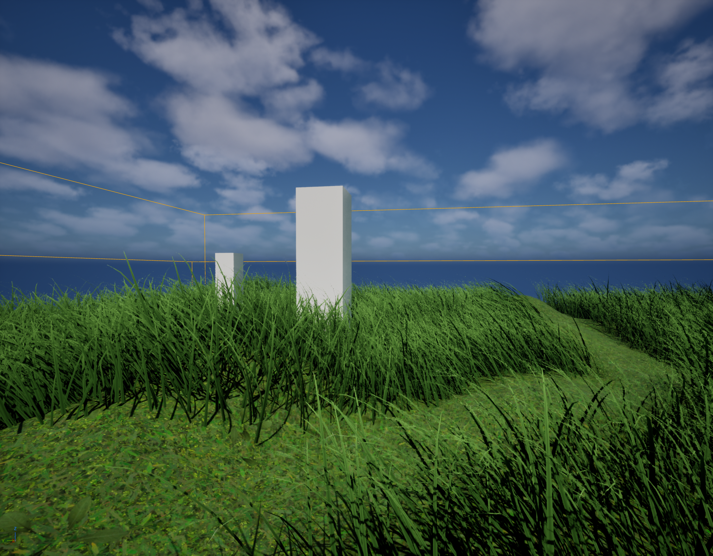

# UE5 Procedural Grassland

Unreal Engine 5.8 程序化草地实验：用 PCG 控制草簇与剔除区域，用 WPO 生成草叶形态和风动，并通过 HISM、Static Mesh LOD 与实例自定义数据组织大量草实例。



阅读入口：`PCG_Grass` / `SG_Grass_CommonFilter` 负责分布，`M_Grass` 与距离材质实例负责外观，`BP_GrassInteractionManager` 与双 Render Target 负责交互草地实验。PCG、材质与交互逻辑保存在 UE 二进制资产中；`Source/` 保留第三人称模板及其玩法变体的 C++ 模块。

## 当前进度

- 使用 `PCG Volume` 在 Landscape 上采样生成草点。
- 通过 `Surface Sampler` 控制基础密度、点尺寸和随机松散度。
- 使用 Voronoi/Spatial Noise 写入 `ClumpID`，再按区间过滤形成草簇。
- 为不同草簇接入独立的 `Transform Points`，控制每簇的缩放、旋转和分布差异。
- 使用 `Merge` 合并多路草簇结果，再进入 `Self Pruning` 和 `Static Mesh Spawner`。
- 草材质使用平面网格配合 WPO 生成草叶形态，并加入风场摆动参数。
- 通过 `PerInstanceCustomData` 从 PCG 向材质传递随机值，用于草色和局部变化。
- 支持用 Spline 和带标签的 Actor 对草地进行剔除，便于留出道路、障碍物或人工区域。
- 增加了地表草地材质，用来配合 PCG 草叶形成更完整的草地视觉。
- 将草实例组件从普通 `InstancedStaticMeshComponent` 调整为 `HierarchicalInstancedStaticMeshComponent`，大量草实例下帧率稳定性明显提升。
- 使用 UE Static Mesh 自带 LOD 管理近景、中景和远景草表现，不再使用 `Grid Size` / HiGen 分层方案。
- 为草地 LOD 准备了 Near、Mid、Far、Far_Far 多套材质实例，用于区分不同距离下的风场、颜色和材质复杂度。
- 增加 Render Target 草地交互实验，包含交互管理蓝图、状态/历史纹理以及 Brush、Copy、Decay 材质。

## 关键实现

### PCG 草地生成

核心图位于：

```text
Content/ProceduarlGrass/PCG/PCG_Grass
```

当前流程大致为：

```text
Landscape Data
-> Surface Sampler
-> Spline / Actor Difference
-> Rand0 / Rand1 / ClumpID
-> Spatial Noise
-> Attribute Filter Range
-> Transform Points
-> Merge
-> Self Pruning
-> Static Mesh Spawner
```

其中 `ClumpID` 用来划分草簇，`Rand0` 和 `Rand1` 用来提供随机变化。多路过滤结果需要显式接入 `Merge`，再进入后续节点，否则后面的节点可能只处理最后一路输入。

部分公共过滤逻辑已拆到子图：

```text
Content/ProceduarlGrass/PCG/SG_Grass_CommonFilter
```

子图用于沉淀道路/Actor 剔除、Noise、Transform 等公共处理逻辑，主图主要负责串联采样、公共过滤和最终生成。

### 草材质

草材质位于：

```text
Content/ProceduarlGrass/Materials/M_Grass
Content/ProceduarlGrass/Materials/M_Grass_Inst
Content/ProceduarlGrass/Materials/M_Grass_Inst_Near
Content/ProceduarlGrass/Materials/M_Grass_Inst_Mid
Content/ProceduarlGrass/Materials/M_Grass_Inst_Far
Content/ProceduarlGrass/Materials/M_Grass_Inst_Far_Far
```

材质中用 WPO 生成草叶形态。曲线输出是偏移向量，因此需要用 `TransformVector` 而不是 `TransformPosition`，否则 PCG 实例会出现整体位置偏移。

材质还包含风场参数和 `PerInstanceCustomData` 读取，用于让 PCG 生成的实例带有颜色和形态上的轻微差异。

### 实例与 LOD 优化

草实例目前通过 `Static Mesh Spawner` 生成，并使用：

```text
HierarchicalInstancedStaticMeshComponent
```

替代普通 `InstancedStaticMeshComponent`。原开发记录在当时测试场景中观察到大量草实例下帧率稳定到约 60 FPS。仓库没有记录该次测试的硬件、分辨率、实例数量、编辑器/打包模式或完整计时数据，因此保留这个数值作为历史观察，不作为通用性能承诺；本次整理也没有重新测量 FPS。

近景、中景和远景的差异不再通过 PCG 的 `Grid Size` 分层实现，而是交给 Static Mesh LOD 和材质实例处理：

- LOD0：近景草，使用更完整的材质和风场。
- LOD1/LOD2：中远景草，使用更弱的风场、更低的高光和更便宜的材质参数。
- 远处草主要依赖 Cull Distance 与地表材质过渡，避免继续堆叠高密度实例。

在原项目迭代记录中，这套方案比此前尝试的 Runtime HiGen 配置更稳定，也避免了复制多套 `Surface Sampler`、Difference、Noise 和 Transform 节点。具体生成开销仍需在相同场景和硬件下比较。

### 剔除区域

目前支持两种剔除方式：

- Spline：用于道路或路径类区域。
- Actor Tag：用于用 Static Mesh Actor 或体积类对象剔除草。

Actor 剔除依赖 `Actor Tags`，不是 Component Tags。PCG 中的 `Get Actor Data` 需要能查询到对应标签的 Actor，之后再通过 `Difference` 从草点中减去这部分区域。

## 使用方式

准备与 `Proceduarl_Grass.uproject` 匹配的 **UE 5.8**。C++ Target 也使用 `Unreal5_8` include order 与 `BuildSettingsVersion.V7`，仅更改引擎关联到旧版本不能保证编译通过。需要该 UE 版本支持的 Windows C++ 编译工具链与 SDK；工程包含 Runtime 和 Editor 原生模块。

```sh
git clone https://github.com/JiaT-T/UE5-Procedural-Grassland.git
cd UE5-Procedural-Grassland
```

首次打开前，生成项目文件并构建 `Proceduarl_GrassEditor` 的 Development Editor 目标，或让 Editor 在打开时编译该模块。确认 PCG 插件可用；工程描述符还启用了 StateTree、GameplayStateTree 与 ModelingToolsEditorMode。保留完整 `Content/`，包括外部 Actor/Object 与 `_GENERATED` 下的持久资产。

1. 使用 Unreal Engine 5.8 打开：

```text
Proceduarl_Grass.uproject
```

2. 打开测试关卡：

```text
Content/ProceduarlGrass/Levels/Grass
```

3. 选中关卡中的 PCG Volume，在 PCG Component 中执行：

```text
Cleanup -> Generate
```

4. 如需调整草地效果，优先修改：

- `PCG_Grass_Inst` 中的密度、Voronoi 分辨率、剔除范围等参数。
- `M_Grass_Inst_Near`、`M_Grass_Inst_Mid`、`M_Grass_Inst_Far` 等材质实例中的草色、风场、WPO 和随机变化参数。
- 草 Static Mesh 中的 LOD 切换距离、材质槽和 Cull Distance。
- Spline 或带标签 Actor 的位置、尺寸和标签。

## 已知注意点

- `Saved/`、`Intermediate/`、`DerivedDataCache/`、`Binaries/` 等 UE 生成目录不纳入版本管理。
- 当前内容仍是技术实验阶段，重点在 PCG 流程和材质表现，不是完整游戏关卡。
- Masked 草材质、WPO 风场和大量实例容易带来闪烁、过度绘制和阴影噪声，后续还需要继续调材质和渲染参数。
- 如果 Actor 剔除没有生效，优先检查标签是否写在 `Actor Tags`，以及 PCG 是否重新 `Cleanup -> Generate`。
- 之前尝试过 `Grid Size` / Runtime HiGen 近中景分层，但会显著增加 PCG 生成任务数量，当前版本改用 HISM + Static Mesh LOD 作为主要优化路径。

## 交互与验证范围

交互实验的资产入口：

```text
Content/ProceduarlGrass/BluePrint/BP_GrassInteractionManager
Content/ProceduarlGrass/Materials/MPC_GrassInteraction
Content/ProceduarlGrass/Materials/RT_GrassState
Content/ProceduarlGrass/Materials/RT_GrassPrev
Content/ProceduarlGrass/Materials/M_RT_Brush / M_RT_Copy / M_RT_Decay
```

这些资产存在于当前版本；具体蓝图连线、Render Target 更新顺序和最终弯曲效果应在 UE Editor 中检查。2026 年 9 月仓库整理核对了配置、C++ Target、资产路径与既有预览，环境中没有匹配的 UE 5.8 Editor，因此未验证编译、PCG 生成、LOD 切换或交互效果。

项目名、模块名和资产路径中的 `Proceduarl` 拼写保持原状，避免在未检查 Redirector / Asset Reference 的情况下改变引用。

## 来源与许可范围

`Source/` 中的 Epic 模板代码保留原版权声明；`Content/Characters/Mannequins/` 等引擎模板资产适用各自的来源条款。草地地表纹理使用 `Grass001_2K-JPG_*` 命名，但仓库没有附上其下载来源和许可证明。根目录的 MIT 文件不能代替第三方内容的授权；本次整理不更改许可证，也不将这些资产重新授权。
